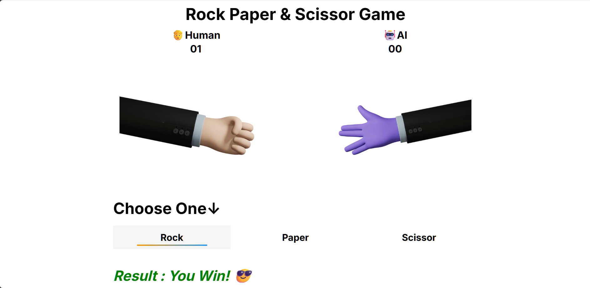

# Rock Paper Scissor Game

A classic Rock, Paper, Scissor game built with HTML, CSS, and JavaScript. Play against the computer and see who wins! c

## Game Preview



## Features

-   Play Rock, Paper, Scissor against the computer.
-   Simple and intuitive user interface.
-   Score tracking for both player and AI.
-   Responsive design for a great experience on all devices.
-   Visual feedback for win, lose, and tie results.

## Technologies Used

-   **HTML5:** For the basic structure of the game.
-   **CSS3:** For styling the user interface and making it responsive.
-   **JavaScript:** For the game logic and interactivity.

## How to Play

1.  Open the `index.html` file in your web browser or visit the live demo link.
2.  Click on one of the buttons: "Rock", "Paper", or "Scissor".
3.  The computer will make its choice, and the result will be displayed.
4.  The scores will be updated accordingly.
5.  Keep playing and try to beat the AI!

## File Structure

```
Rock-Paper-Scissor-JS-Game/
├── assests/
│   ├── AIpaper.png
│   ├── AIrock.png
│   ├── AIscissors.png
│   ├── HUMANpaper.png
│   ├── HUMANrock.png
│   ├── HUMANscissors.png
│   ├── Purple-in-Jacket9.png
│   └── White-in-Jacket1.png
├── index.html
├── index.js
├── README.md
└── styles.css
```

## License

This project is licensed under the MIT License - see the [LICENSE.md](LICENSE.md) file for details.

## Acknowledgments

-   The hand images were created for this project.
-   The design was inspired by various online Rock, Paper, Scissor games.

